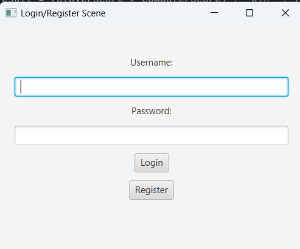
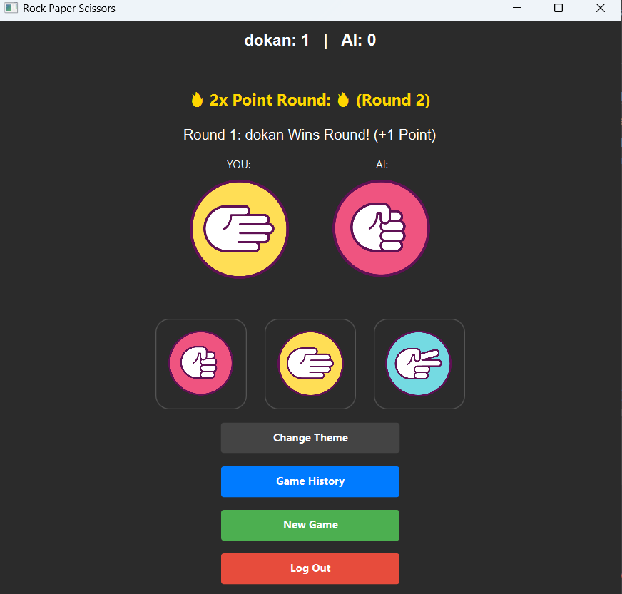
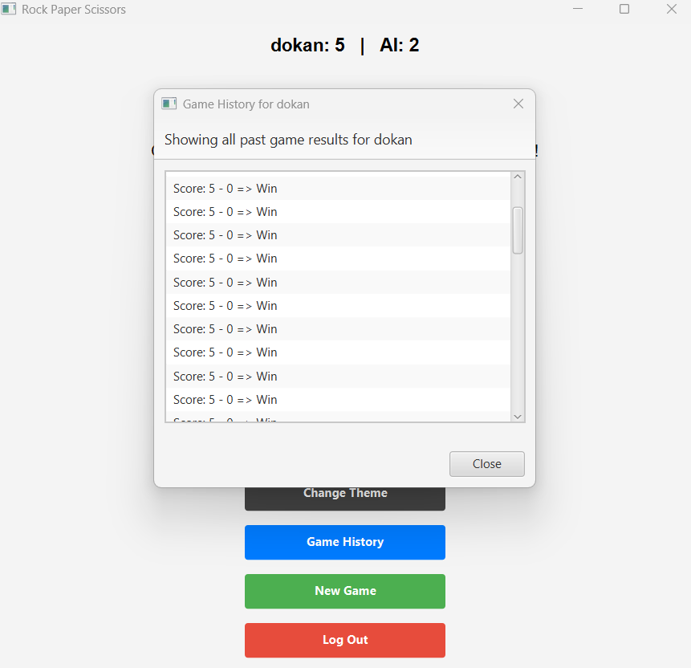
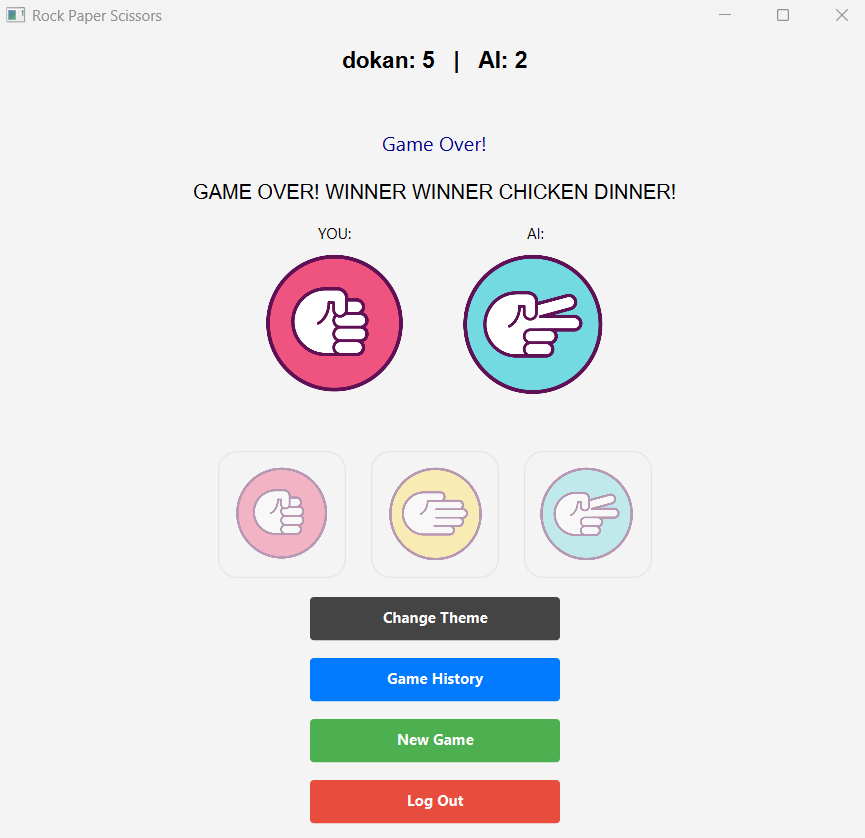

# Rock Paper Scissors - JavaFX Game 🎮

This is a Rock-Paper-Scissors game built using **JavaFX** as a final project for the Programming II course (Section 2). The application supports single-player gameplay against a computer opponent, enhanced with authentication, score tracking, themes, and more!

## 🛠 Features

- ✅ **User Authentication**: Registration and login/logout system.
- 🎲 **Computer AI**: Randomized computer moves.
- 💾 **File Handling**: Stores user credentials and gameplay history in `.txt` files.
- 📈 **Score Tracking**: Real-time score updates.
- 🔁 **Reset Option**: Restart the game at any point.
- 🌗 **Theme Toggle**: Light and Dark mode.
- ✌️ **Double Points Round**: Random bonus round worth 2 points.
- 📜 **Game History View**: Displays past match history.


## 📸 Screenshots






## 🚀 Installation & Run

### Requirements
- Java 17+
- JavaFX SDK
- IDE like IntelliJ IDEA or Eclipse

### Steps
1. Clone the repository:
   ```bash
   git clone https://github.com/dogukanyusaboz/RockPaperScissorsJFX.git
   cd RockPaperScissorsJFX
